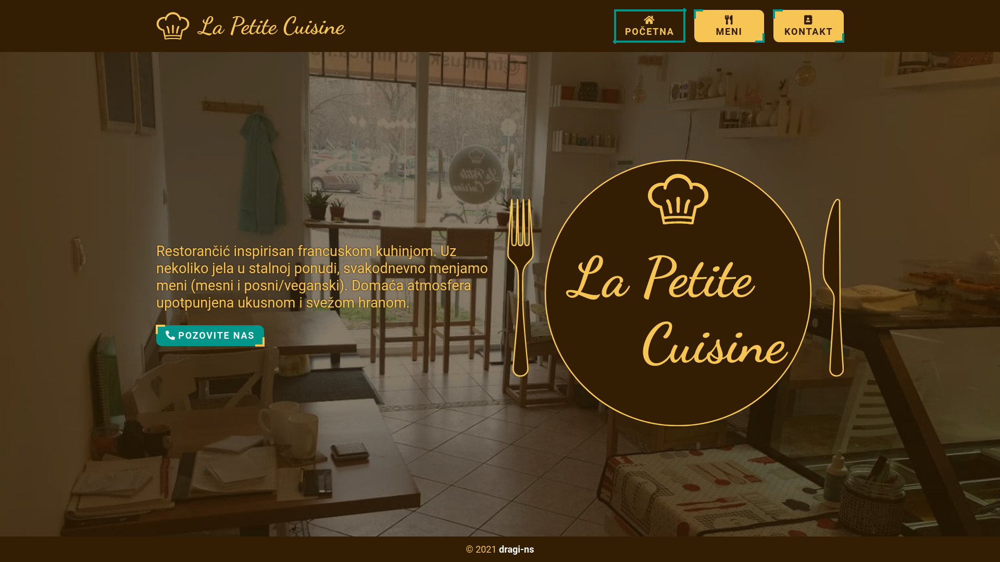
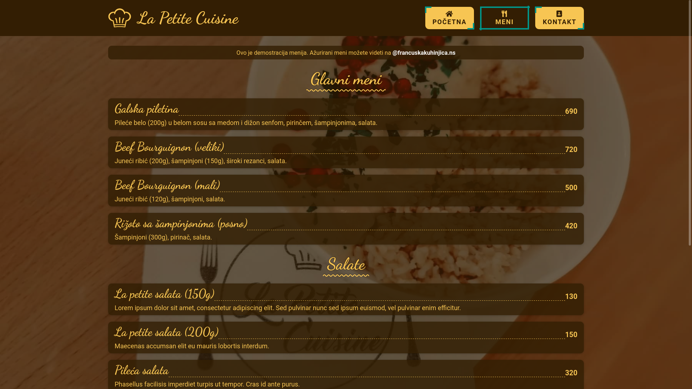
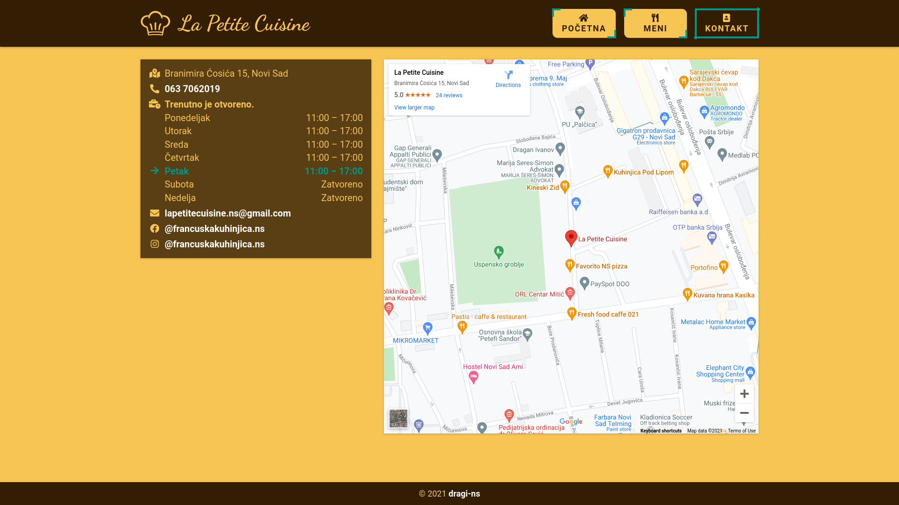
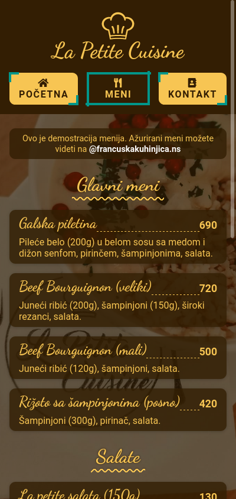
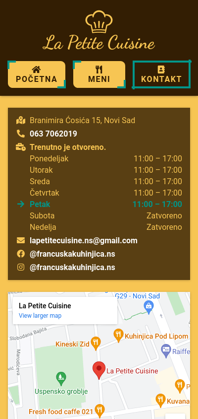

# Restaurant page - Odin project
Restaurant page with multiple tabs implemented in vanilla Javascript and webpack module bundler. This project was an assignment from [Odin's Full Stack JavaScript path](https://www.theodinproject.com/paths/full-stack-javascript/courses/javascript/lessons/restaurant-page).

## Screenshots

### Desktop

### Mobile

## Demo

